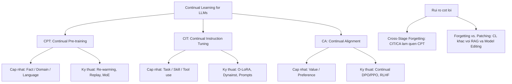

# 🧠 Báo Cáo Tổng Hợp: Khảo Sát Tổng Quan Về Học Liên Tục Trên LLM (Group 1 - Surveys)

Tài liệu này tổng hợp **những phát hiện và khung lý thuyết tâm đắc nhất** từ 4 bài báo khảo sát hệ thống (Surveys) thuộc **Group 1 (lưu trữ tại thư mục Suvery)**. Đây là cẩm nang định hình khái niệm, hệ thống hóa các phương pháp và phân tầng toàn bộ vòng đời huấn luyện liên tục của LLM.

---

## 📌 Bản Đồ Insights & Phân Tầng Hệ Thống (Surveys)

---

## 1. 🏗️ Phân Tầng Tiến Trình Huấn Luyện Liên Tục (Three-Stage Alignment)
*Nguồn nghiên cứu: "Continual Learning for Large Language Models: A Survey" (Tongtong Wu et al.)*

Các bài khảo sát thống nhất phân chia toàn bộ vòng đời học liên tục của LLM thành 3 giai đoạn chính, tương ứng với loại tri thức cần cập nhật:

1.  **Huấn Luyện Tiền Đề Liên Tục (Continual Pre-training - CPT):**
    *   *Nhiệm vụ:* Cập nhật các sự kiện thực tế mới (Facts), tri thức chuyên ngành mới (Domain knowledge) hoặc ngôn ngữ mới (Languages).
    *   *Đặc trưng:* Sử dụng học tự giám sát (self-supervised causal LM loss) trên lượng lớn văn bản thô.
2.  **Tinh Chỉnh Chỉ Thị Liên Tục (Continual Instruction Tuning - CIT):**
    *   *Nhiệm vụ:* Dạy mô hình thực hiện các dạng tác vụ mới (Tasks) hoặc sử dụng các công cụ mới (Skills/Tool use) thông qua định dạng Prompt chỉ dẫn.
    *   *Đặc trưng:* Tinh chỉnh có giám sát (SFT) trên các tập chỉ dẫn chất lượng cao.
3.  **Căn Chỉnh Liên Tục (Continual Alignment - CA):**
    *   *Nhiệm vụ:* Cập nhật giá trị đạo đức con người (Values) hoặc căn chỉnh theo sở thích hành vi của người dùng (Preferences) khi các chuẩn mực xã hội thay đổi.
    *   *Đặc trưng:* Huấn luyện bằng học tăng cường từ phản hồi (PPO, DPO, RLHF).

---

## 2. ⚡ Sự Khác Biệt Giữa Học Thực Sự (Continual Learning) và Vá Lỗi Tri Thức
*Nguồn nghiên cứu: "Towards Lifelong Learning of LLMs: A Survey" & "Generative AI Survey"*

Các bài viết làm rõ ranh giới kỹ thuật giữa Học liên tục với hai nhóm giải pháp phổ biến khác:

*   **So với RAG (Retrieval-Augmented Generation):** RAG là cơ chế nạp bộ nhớ ngoài tạm thời qua ngữ cảnh (context), không làm thay đổi trọng số mô hình. Continual Learning hướng tới tích hợp tri thức trực tiếp vào cấu trúc trọng số của mô hình (parametric memory), nâng cao khả năng tư duy và suy luận tự thân.
*   **So với Model Editing (Chỉnh sửa mô hình):** Model Editing (như ROME, MEMIT) chỉ thực hiện "vá" các lỗi sự kiện cục bộ rất nhỏ (ví dụ sửa câu trả lời cho một câu hỏi cụ thể). Continual Learning giúp mô hình hấp thụ toàn bộ một miền tri thức rộng lớn và có khả năng tổng quát hóa (generalization) sang các tác vụ liên quan.

---

## ⚠️ Thách Thức Lớn Nhất: Quên Chéo Giai Đoạn (Cross-Stage Forgetting)

> [!CAUTION]
> **Hiện tượng Quên chéo giai đoạn (Cross-Stage Forgetting):**
> Quá trình tối ưu hóa ở các giai đoạn sau (ví dụ chạy CIT hay CA) vốn dĩ luôn đặt các tri thức nền tảng đã học ở giai đoạn trước (CPT) vào trạng thái cực kỳ dễ bị tổn thương. Việc dạy mô hình làm một tác vụ mới (CIT) có thể vô tình xóa bỏ các rào cản an toàn hoặc khả năng tư duy logic bách khoa ban đầu của mô hình.

---

## 💡 Đề Xuất Thiết Kế Quy Trình VN-Legal-AI
Từ lăng kính khảo sát tổng quan, dự án phát triển mô hình Luật Việt Nam cần được thiết lập theo sơ đồ chuẩn hóa sau:

1.  **Giai đoạn 1 (CPT):** Nạp toàn bộ các bộ luật, nghị định, thông tư thô của Việt Nam vào mô hình bằng Continual Pre-training. Đây là giai đoạn xây dựng **tri thức nền (Domain & Facts)**.
2.  **Giai đoạn 2 (CIT):** Huấn luyện mô hình thực hiện các tác vụ nghiệp vụ ngành luật (soạn văn bản pháp lý, phân tích hành vi phạm tội, tra cứu điều khoản) bằng Continual Instruction Tuning.
3.  **Giai đoạn 3 (CA):** Thiết lập các bộ lọc an toàn và căn chỉnh hành vi (Continual Alignment) để đảm bảo mô hình đưa ra các tư vấn trung lập, tuân thủ đạo đức nghề nghiệp tư pháp và pháp luật Việt Nam.
4.  **Hồi quy đánh giá:** Bắt buộc phải thiết lập hệ thống kiểm tra chéo (cross-stage evaluation). Sau khi tinh chỉnh xong Giai đoạn 2 & 3, phải mang mô hình quay lại làm các bài test của Giai đoạn 1 để đảm bảo mô hình không bị "quên chéo" các điều khoản luật cơ bản.
