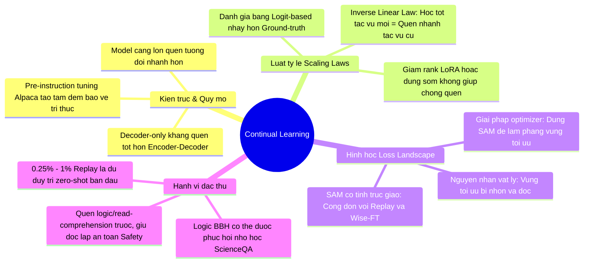

# 🧠 Báo Cáo Tổng Hợp: Các Phát Hiện Cốt Lõi Về Học Liên Tục & Quên Thảm Khốc (Group 2)

Tài liệu này tổng hợp **những phát hiện tâm đắc nhất** từ 6 bài báo chuyên sâu thuộc **Group 2: Catastrophic Forgetting & Benchmarks in LLMs**. Đây là các kết quả thực nghiệm và lý thuyết nền tảng cực kỳ quan trọng, trực tiếp định hướng cho việc tinh chỉnh (fine-tuning) các mô hình ngôn ngữ lớn chuyên ngành như mô hình Pháp luật Việt Nam (`VN-Legal-AI`).

---

## 📌 Bản Đồ Insights & Các Phát Hiện Tâm Đắc Nhất



---

## 1. ⚙️ Quy Luật Tỷ Lệ Của Sự Quên Lãng (Scaling Laws for Forgetting)
*Nguồn nghiên cứu: "Scaling Laws for Forgetting When Fine-Tuning Large Language Models" (rsLoRA)*

> [!WARNING]
> **Đập tan các quan niệm cũ của kỹ sư thực hành:**
> Thực nghiệm toán học chứng minh rằng các thủ thuật thông thường như **dừng sớm (early stopping)** hoặc **giảm rank của LoRA** không hề có tác dụng chống quên lãng thảm họa.

*   **Định luật Tuyến tính Nghịch đảo (Inverse Linear Law):** Mức độ quên lãng ($L_f$) tỉ lệ thuận trực tiếp với hiệu quả học tác vụ mới ($L_{ft}$). Nếu mô hình học cực tốt tác vụ mới, nó chắc chắn sẽ quên sâu sắc tri thức cũ. Việc giảm rank LoRA (ví dụ từ 64 xuống 8) chỉ làm mô hình quên ít đi vì nó... học tác vụ mới kém đi!
*   **Logit-based Evaluation:** Đánh giá độ trôi tri thức bằng cách so sánh phân phối xác suất (logits) trực tiếp với mô hình pre-trained gốc thay vị nhãn ground-truth. Phương pháp này nhạy bén hơn gấp nhiều lần trong việc phát hiện sự suy giảm khả năng lập luận và độ lệch tham số.
*   **Mất an toàn hệ thống:** Việc tinh chỉnh LoRA (ngay cả ở rank 8) làm sụt giảm nghiêm trọng khả năng từ chối các yêu cầu độc hại (AdvBench). Mô hình dễ dàng bị jailbreak để sinh mã độc phá hoại do đã quên đi hàng rào an toàn pre-train.

---

## 2. 🗺️ Lăng Kính Hình Học: Làm Phẳng Không Gian Tối Ưu (Loss Landscape Flatness)
*Nguồn nghiên cứu: "Revisiting Catastrophic Forgetting in Large Language Model Tuning" (SAM)*

> [!IMPORTANT]
> **Nguyên nhân vật lý của Quên thảm khốc:**
> Khi LLM học trên một miền dữ liệu lệch pha phân phối (OOD), không gian hàm mất mát (loss landscape - LLS) sẽ bị bóp méo, tạo ra các **"hẻm núi" cực kỳ nhọn và dốc (sharp LLS)**. Khi phân phối dữ liệu thay đổi, chỉ cần một dịch chuyển nhỏ của trọng số sẽ làm loss vọt lên vô hạn, gây ra hiện tượng quên sạch kiến thức cũ.

```
      HẺM NÚI NHỌN (AdamW)                 THUNG LŨNG PHẲNG (SAM)
            \       /                              \               /
             \     /                                \             /
              \   /                                  \___________/
            (Nhạy cảm với trôi tham số)         (Bền vững, chống quên lãng)
```

*   **Giải pháp Optimizer (SAM):** Thay vì dùng AdamW, sử dụng thuật toán **Sharpness-Aware Minimization (SAM)** để chủ động tìm kiếm các vùng trọng số có loss landscape phẳng.
*   **Tính trực giao cộng dồn (Orthogonal Complementarity):** Do SAM can thiệp ở cấp độ tối ưu hóa trọng số (optimizer), nó hoàn toàn tương thích và mang lại **hiệu năng cộng dồn** khi kết hợp với các phương pháp ở tầng dữ liệu (Rehearsal) hoặc tầng mô hình (Wise-FT):
    *   Wise-FT đơn thuần: $+0.97\%$ hiệu năng giữ tri thức.
    *   Rehearsal đơn thuần kết hợp SAM: **Tăng vọt $+3.02\%$** hiệu năng giữ tri thức trung bình.
*   **Hiệu quả vượt trội:** SAM chỉ cần chạy **1 epoch** đã vượt qua hiệu năng chống quên của AdamW chạy 2 epochs ở cùng mức chi phí tính toán FLOPs.

---

## 3. 🏗️ Ảnh Hưởng Của Kiến Trúc, Quy Mô & Lịch Sử Huấn Luyện
*Nguồn nghiên cứu: "An Empirical Study of Catastrophic Forgetting in LLMs..."*

*   **Ưu thế tuyệt đối của Decoder-only:** Trong cùng điều kiện huấn luyện và quy mô tham số, kiến trúc chỉ giải mã (**Decoder-only** - BLOOMZ, LLaMA) kháng quên tốt hơn rất nhiều so với kiến trúc mã hóa-giải mã (**Encoder-Decoder** - mT0).
*   **Nghịch lý quy mô tương đối:**
    *   Các mô hình có quy mô tham số lớn hơn (ví dụ 7B so với 1B) có **tốc độ quên tương đối ($FG\%$) nhanh hơn** do điểm xuất phát ban đầu của chúng rất cao.
    *   Tuy nhiên, xét về **điểm số tuyệt đối (absolute score)**, mô hình lớn vẫn hoạt động tốt hơn hoặc bằng mô hình nhỏ sau chuỗi học liên tục.
*   **Tấm đệm bảo vệ Alpaca:** Các mô hình đã trải qua pha tinh chỉnh chỉ dẫn đa dạng trước đó (như Alpaca) sở hữu một **"tấm đệm tri thức" (knowledge buffer)** rất bền vững, giúp giảm thiểu đáng kể tốc độ quên ở các pha tinh chỉnh chuyên biệt tiếp theo so với các base model thuần (LLaMA).
*   **Tác dụng phụ tích cực (Bias Mitigation):** Việc quên lãng tri thức cũ trong học liên tục giúp làm **giảm đáng kể các định kiến xã hội** độc hại (đo qua CrowSPairs) được lưu trữ sẵn trong LLM từ pha pre-training.

---

## 4. 🔄 Hiệu Ứng Phát Lại Cực Hạn (Ultra-low Rehearsal)
*Nguồn nghiên cứu: "Fine-tuned Language Models are Continual Learners" (Continual-T0)*

*   **Tỷ lệ phát lại siêu nhỏ (0.25% - 1.0%):** Trái với suy nghĩ thông thường rằng cần phải phát lại (replay) một lượng lớn dữ liệu cũ, thực nghiệm chứng minh chỉ cần trộn từ **0.25% đến 1.0%** dữ liệu huấn luyện cũ (rehearsal) là đủ để duy trì gần như hoàn hảo năng lực zero-shot ban đầu của mô hình.
*   **Tầm quan trọng của Pre-training:** Các transformer khởi tạo ngẫu nhiên hoàn toàn không thể học liên tục ổn định dù có dùng kỹ thuật gì đi nữa. Khả năng kháng quên lãng thực chất được thừa hưởng từ pha tiền huấn luyện tự giám sát quy mô lớn của LLM.

---

## 📊 Bảng Đối Chiếu Các Phát Hiện Thực Nghiệm Chính

| Bài báo khoa học | Phát hiện cốt lõi | Ý nghĩa thực tiễn cho VN-Legal-AI |
| :--- | :--- | :--- |
| **rsLoRA (Scaling Laws)** | Mối liên kết tuyến tính nghịch đảo chặt chẽ giữa học mới và quên cũ. Giảm rank LoRA không chống được quên. | Muốn mô hình học Luật sâu sắc mà không quên tri thức chung, bắt buộc phải dùng kỹ thuật kháng quên chuyên biệt (không thể dựa vào dừng sớm). |
| **SAM (Revisiting CF)** | Loss Landscape phẳng tương quan trực tiếp với độ kháng quên. SAM hoạt động trực giao với Rehearsal. | Cấu hình optimizer sử dụng SAM/rsLoRA kết hợp với một lượng nhỏ Rehearsal dữ liệu luật ban đầu để tối ưu hóa trọng số phẳng. |
| **Empirical Study of CF** | Decoder-only bền vững hơn Encoder-Decoder. Sử dụng mô hình đã có SFT (Alpaca-like) làm giảm tốc độ quên. | Nên ưu tiên chọn Base Model dạng Decoder-only (như LLaMA-3, Qwen) đã qua căn chỉnh chỉ dẫn (Instruction-tuned) để tiếp tục tinh chỉnh Luật. |
| **Continual-T0** | Chỉ cần 0.25% - 1% replay dữ liệu cũ là giữ được năng lực zero-shot. | Thiết lập luồng data loader trộn tối thiểu 0.5% dữ liệu pre-train chung vào tập dữ liệu Luật chuyên ngành. |
| **TRACE Benchmark** | Khả năng tuân thủ chỉ dẫn (helpfulness) dễ mất, hàng rào an toàn (safety) cực kỳ trơ và khó quên. | Cần bổ sung các bài test tự động về tính tuân thủ chỉ dẫn sau mỗi checkpoint huấn luyện Luật chuyên ngành. |
| **ConTinTin** | Các tác vụ phân loại (classification) trùng lặp nhãn dễ gây quên nhất do xung đột không gian nhãn. | Khi học liên tục các tác vụ pháp luật, cần thiết kế các hướng dẫn (instructions) phân biệt rõ ràng không gian nhãn. |

---

## 💡 Đề Xuất Chiến Lược Huấn Luyện Cho VN-Legal-AI
Dựa trên các phát hiện "tâm đắc" ở trên, quy trình tinh chỉnh mô hình Luật chuyên ngành nên áp dụng các tiêu chuẩn sau:

1.  **Lựa chọn mô hình xuất phát:** Chọn mô hình **Decoder-only** đã qua Instruction Tuning (ví dụ: `Qwen-2.5-7B-Instruct` hoặc `Llama-3-8B-Instruct`) thay vì base model thuần để tận dụng "tấm đệm tri thức".
2.  **Thiết lập Optimizer:** Thay thế AdamW bằng **SAM (Sharpness-Aware Minimization)** kết hợp với **rsLoRA** để ép không gian trọng số phẳng ra, giảm độ trôi tham số khi học dữ liệu Luật.
3.  **Trộn dữ liệu siêu nhỏ:** Cấu hình luồng dữ liệu trộn thêm **0.5% dữ liệu chat tổng quát đa lĩnh vực** vào tập dữ liệu văn bản Pháp luật chuyên ngành để duy trì khả năng zero-shot và tư duy thông thường.
4.  **Đánh giá checkpoint nhạy cảm:** Đo đạc chất lượng mô hình bằng phương pháp **Logit-based cross-entropy** đối chiếu với checkpoint pre-trained gốc trên tập dữ liệu WikiText hoặc tương đương tiếng Việt, giúp phát hiện sớm hiện tượng suy hao tri thức trước khi ảnh hưởng đến điểm Accuracy.
