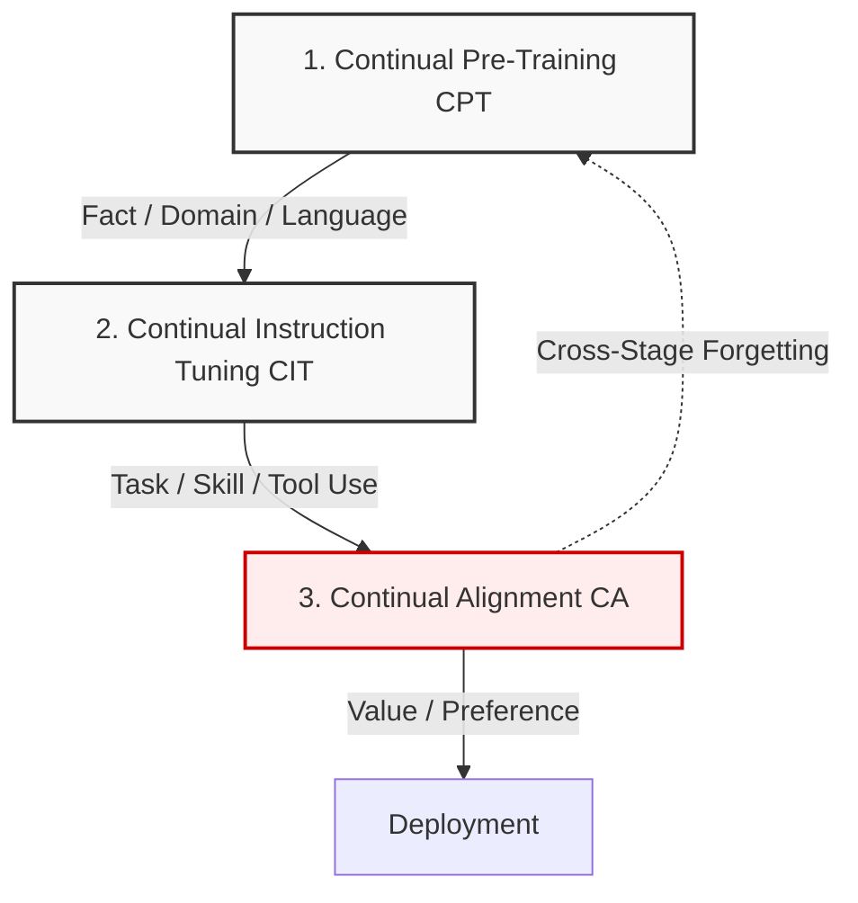
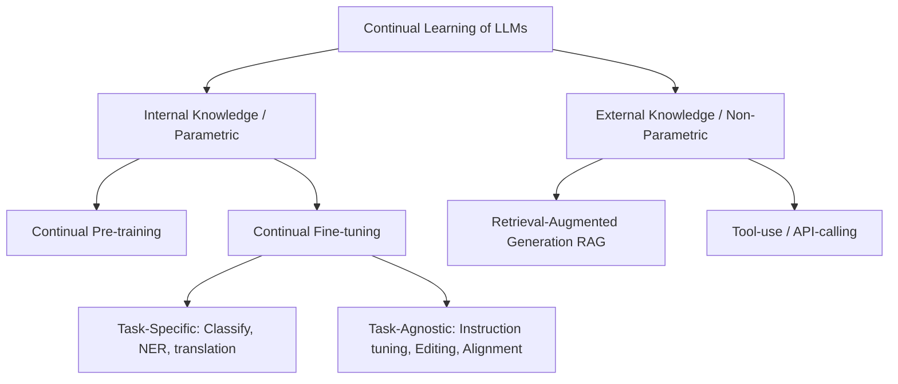
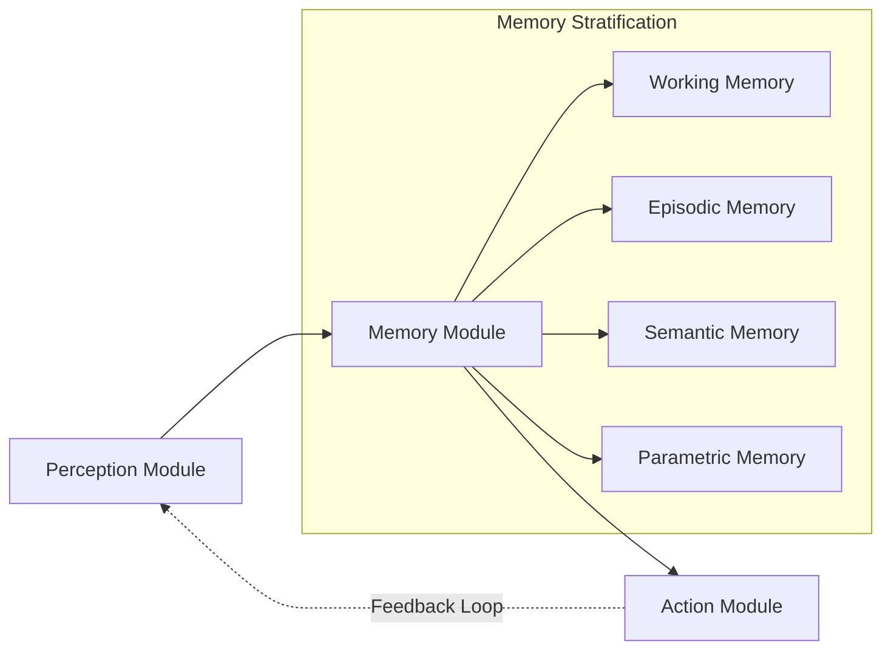

# 🧠 Group 1 Synthesis: Surveys on Continual Learning & Lifelong Agents

This document consolidates the most valuable diagrams and comparative tables from the Group 1 surveys for presentation and thesis screenshots.

---

## 📌 1. Systems & Architectures Diagrams

### Three-Stage LLM Continual Learning Lifecycle
*   **Source:** Wu et al. (2024), *"Continual Learning for Large Language Models: A Survey"* (arXiv:2402.01364)
*   **BibTeX Key:** `wu2024continuallearninglargelanguage`

### Internal vs. External Knowledge Taxonomy
*   **Source:** Zheng et al. (2024), *"Towards Lifelong Learning of Large Language Models: A Survey"* (arXiv:2406.06391)
*   **BibTeX Key:** `zheng2024lifelonglearninglargelanguage`

### Perception-Memory-Action Agent Framework
*   **Source:** Zheng et al. (2026), *"Lifelong Learning of Large Language Model Based Agents: A Roadmap"* (IEEE Transactions on Pattern Analysis & Machine Intelligence)
*   **BibTeX Key:** `11328884`

---

## 📊 2. Consolidated Comparison Tables

### Table 1: Knowledge-to-Stage Mapping & Legal-Domain Interpretation
*   **Source:** Adapted from Wu et al. (2024), *"Continual Learning for Large Language Models: A Survey"* (arXiv:2402.01364) and Shi et al. (2024), *"Continual Learning of Large Language Models: A Comprehensive Survey"* (arXiv:2404.16789)
*   **BibTeX Keys:** `wu2024continuallearninglargelanguage`, `shi2024continuallearninglargelanguage`

| Knowledge Type | CPT | CIT | CA | Legal-Domain Interpretation |
| :--- | :---: | :---: | :---: | :--- |
| **Fact** | $\circ$ | $\times$ | $\times$ | New statutory clauses, regulatory amendments $\rightarrow$ RAG Memory |
| **Domain** | $\circ$ | $\circ$ | $\times$ | Legal terminology, administrative structures, document grammar |
| **Language** | $\circ$ | $\times$ | $\times$ | Vietnamese (strong out-of-distribution shift for baseline models) |
| **Task** | $\times$ | $\circ$ | $\times$ | Legal QA, Natural Language Inference, Syllogistic reasoning |
| **Skill (Tool)**| $\times$ | $\circ$ | $\times$ | Dynamic citation lookup, database searching |
| **Value** | $\times$ | $\times$ | $\circ$ | Judicial and professional ethics, compliance with the Constitution |
| **Preference** | $\times$ | $\times$ | $\circ$ | Writing tone and consulting format |

### Table 2: Comparative Analysis of the 5 Landmark Surveys
*   **Source:** Curation synthesis compiled for CDNCTQ project.

| Survey | Year | Classification Axis | Key Contribution | Relevance to CDNCTQ |
| :--- | :---: | :--- | :--- | :--- |
| **Wu et al.** | 2024 | Stage-aligned (CPT, CIT, CA) | Identified cross-stage forgetting; delineated CL vs. RAG vs. editing | Validates multi-stage pipeline; motivates unlearning triggers |
| **Shi et al.** | 2024 | Dual-axis (vertical vs. horizontal) | Loss flat-basin dynamics; introduced FUAR metric | Framework for domain adaptation (DAP) and temporal checks |
| **Zheng et al.** | 2024 | Internal vs. External knowledge | Decoupled parameter tuning from retrieval memory | Justifies RAG-centric selective memory to prevent parameter drift |
| **Guo et al.** | 2025 | Brain-inspired (architecture, reg., replay) | Generative CL across LLM/MLLM/VLA/Diffusion | Supports RL-based optimization (GRPO) for stability |
| **Zheng et al.** | 2026 | POMDP-guided Perception-Memory-Action | Stratified Memory (Working, Episodic, Semantic, Parametric) | Blueprints the legal agent architecture |
