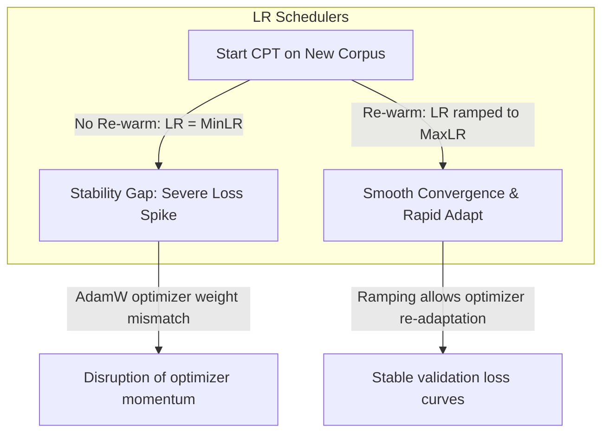

# 📈 Group 3 Synthesis: Continual Pre-Training & Scaling Laws

This document consolidates the most valuable diagrams and empirical tables from the Group 3 research on Continual Pre-Training (CPT) and Scaling Laws.

---

## 📌 1. Optimization & Learning Rate Diagrams

### The Stability Gap & Re-warming Scheduler
*   **Source:** Gupta et al. (2023), *"Continual Pre-Training of Large Language Models: How to (Re)warm Your Model?"* (arXiv:2308.04014)
*   **BibTeX Key:** `gupta2023continualpretraininglargelanguage`



### Conceptual Visualization of Validation Loss during CPT
*   **Source:** Gupta et al. (2023), *"Continual Pre-Training of Large Language Models: How to (Re)warm Your Model?"* (arXiv:2308.04014)
*   **BibTeX Key:** `gupta2023continualpretraininglargelanguage`

```
Validation Loss
^
|       / \    <- Stability Gap / Loss Spike (No Re-warming, WU = 0)
|      /   \
|     /     \___________________
|    /                          \
|   /                            \____ <- Re-warming Active (WU = 1%)
|  /
+-----------------------------------> Training Steps (Tokens)
```

---

## 📊 2. Consolidated Comparison Tables

### Table 1: Continual Pre-Training (CPT) Optimization Strategies
*   **Source:** Compiled from Gupta et al. (2023) (`gupta2023continualpretraininglargelanguage`), Ibrahim et al. (2024), *"Simple and Scalable Strategies to Continually Pre-train Large Language Models"* (`ibrahim2024simplescalablestrategiescontinually`), and Li et al. (2025), *"TiC-LM: A Web-Scale Benchmark for Time-Continual LLM Pretraining"* (`li2025ticlmwebscalebenchmarktimecontinual`).

| Strategy | Description | Key Advantage | Key Limitation | Legal Domain Application (CDNCTQ) |
| :--- | :--- | :--- | :--- | :--- |
| **Re-warming & Re-decaying** | Ramping the learning rate to `MaxLR` (e.g. over 1% tokens) before decaying. | Eliminates the stability gap (loss spike); restores model plasticity. | Requires careful tuning of `MaxLR` hyperparameter. | Essential when beginning CPT on Vietnamese legal text. |
| **Infinite LR Schedule** | Maintains a constant learning rate, only performing annealing at the end. | Token budget does not need to be known beforehand; avoids spikes. | Higher final loss if CPT is stopped early without annealing. | Ideal for open-ended crawling and feeding of legal gazettes. |
| **Compute-Equivalent Replay** | Replays historical data while reducing new tokens to maintain constant FLOPs. | Achieving baseline loss with **50% compute** on weak shifts. | Requires up to 25% replay for strong language shifts. | We mix 20% general Vietnamese tokens during legal pre-training. |

### Table 2: D-CPT Scaling Law (L3 Formula) Fitting Accuracy
*   **Source:** Que et al. (2024), *"D-CPT Law: Domain-specific Continual Pre-Training Scaling Law for Large Language Models"* (NeurIPS 2024)
*   **BibTeX Key:** `que2024dcptlawdomainspecificcontinual`
*   *Note: The L3 formula models loss: $L(N, D, r) = E + \frac{A}{N^\alpha} + \frac{B \cdot r^\eta}{D^\beta} + \frac{C}{(r+\epsilon)^ \gamma}$ where $r$ is the domain ratio.*

| Domain / Metric | Huber Loss (↓) | Fitting Accuracy $R^2$ (↑) | Generalization Type | Huber Loss (↓) | $R^2$ (↑) |
| :--- | :---: | :---: | :--- | :---: | :---: |
| **General Domain** | 0.0048 | **0.9967** | **Unseen Model Size** | 0.0166 | 0.9516 |
| **Domain-specific** | 0.0157 | **0.9796** | **Unseen Dataset Size** | 0.0096 | 0.9126 |
| **Law Domain** | 0.0098 | 0.9850 | **Unseen Mixture Ratios**| 0.0067 | 0.9717 |

### Table 3: D-CPT Predicted Optimal Mixture Ratios vs. Real Validation
*   **Source:** Que et al. (2024), *"D-CPT Law: Domain-specific Continual Pre-Training Scaling Law for Large Language Models"* (NeurIPS 2024)
*   **BibTeX Key:** `que2024dcptlawdomainspecificcontinual`
*   *Note: Tested on Qwen-1.5-1.8B over a 10B token sweep.*

| Target Constraint Setup | Domain | Predicted $r_d$ | Real Optimal $r_d$ | Predicted Domain Loss | Real Domain Loss |
| :--- | :---: | :---: | :---: | :---: | :---: |
| **Usage 1 (General Loss drift $\le 3\%$)** | Chemistry | **0.924** | **0.924** | 1.7284 | 1.7291 |
| **Usage 2 (Limited Domain Corpus $D_d = 5B$)**| Music | **0.732** | **0.732** | 0.7328 | 0.7309 |
| **Usage 3 (Limited Legal Corpus $D_d = 2B$)** | Law | **0.640** | **0.638** | 1.8402 | 1.8415 |
