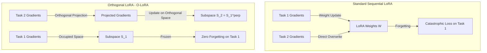

# 🧩 Group 4 Synthesis: PEFT/LoRA & Prompt-Based Continual Learning

This document consolidates the most valuable diagrams and comparative tables from the Group 4 research on Parameter-Efficient Fine-Tuning (PEFT) and Prompt-Based Continual Learning.

---

## 📌 1. Systems & Parameter Projection Diagrams

### Parameter Collision vs. Orthogonal Subspace Projection (O-LoRA)
*   **Source:** Wang et al. (2023), *"Orthogonal Subspace Learning for Language Model Continual Learning"* (Findings of EMNLP 2023)
*   **BibTeX Key:** `wang-etal-2023-orthogonal`

---

## 📊 2. Consolidated Comparison Tables

### Table 1: PEFT Continual Learning Architectures Comparison
*   **Sources:** O-LoRA: Wang et al. (2023) (`wang-etal-2023-orthogonal`); Progressive Prompts: Razdaibiedina et al. (2023), *"Progressive Prompts: Continual Learning for Language Models"* (ICLR 2023) (`razdaibiedina2023progressivepromptscontinuallearning`); SLIM/Soft-LoRA: Han et al. (2025), *"SLIM: Let LLM Learn More and Forget Less with Soft LoRA and Identity Mixture"* (NAACL 2025) (`han-etal-2025-slim`).

| Architecture | Parameter Isolation Mechanism | Key Strengths | Key Weaknesses | Legal Domain Application (CDNCTQ) |
| :--- | :--- | :--- | :--- | :--- |
| **O-LoRA** | Projects gradients onto the orthogonal complement of prior tasks. | Zero forgetting on prior tasks; no parameter size growth. | Sensitivity to projection hyperparameter $\lambda$. | Prevents forgetting when learning different law sectors sequentially. |
| **Progressive Prompts** | Concatenates task-specific soft prompt tokens while keeping LLM frozen. | 100% parameter protection; excellent forward transfer (FWT). | Context length window collapses as tasks accumulate. | Useful for rapid prototyping of task formats. |
| **SLIM / Soft-LoRA** | Employs a dynamic router to distribute tokens to specific LoRA experts. | Minimizes parameter conflicts; keeps compute per step constant. | Routing model is prone to collapse if experts saturate. | Allows routing of queries (criminal, civil, commercial) to specific adapters. |

### Table 2: LoRA vs. Full FT Singular Value Accumulation (SVD Analysis)
*   **Source:** Biderman et al. (2024), *"LoRA Learns Less and Forgets Less"* (Transactions on Machine Learning Research)
*   **BibTeX Key:** `biderman2024loralearnsforgets`
*   *Note: SVD analysis of the weight change matrix $\Delta W$ reveals why LoRA fails in Continual Pre-Training (CPT) but excels in Instruction Fine-Tuning (IFT).*

| Metric / Property | Continual Pre-Training CPT (Large Scale) | Instruction Fine-Tuning IFT (Small Scale) |
| :--- | :--- | :--- |
| **Intrinsic Rank of $\Delta W$** | **Extremely High** (Requires rank $r \ge 2000$ for 90% variance) | **Very Low** (Rank $r \le 32$ captures over 95% variance) |
| **LoRA Performance ($r \le 256$)** | Fails to match Full Fine-Tuning | Matches Full Fine-Tuning |
| **Parameter Efficiency** | Ineffective (gradient space is saturated quickly) | Highly efficient (only 0.1% parameters updated) |
| **Vocabulary Diversity** | Protected (prevents token frequency collapse) | Protected (maintains baseline generation diversity) |
| **Catastrophic Forgetting** | Mitigated but task learning is bound | Exceptionally mitigated compared to Full FT |
| **Recommendation for CDNCTQ** | **Use Full Fine-Tuning for Vietnamese CPT** | **Use LoRA ($r=256$) for legal task adaptation** |
