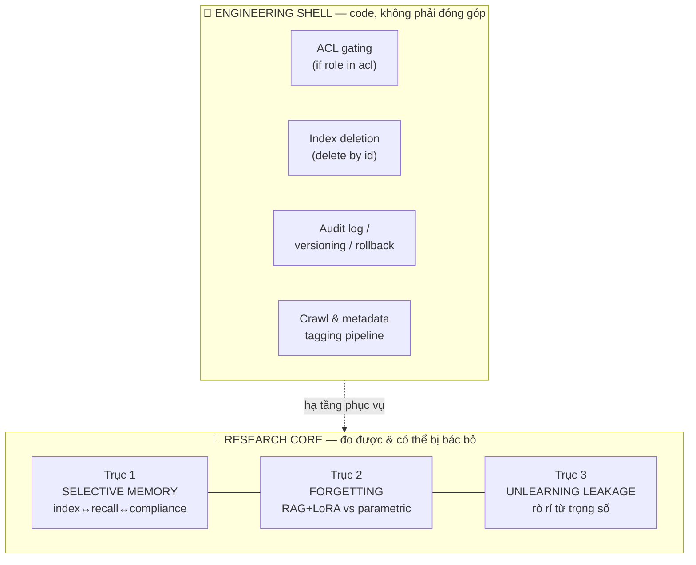
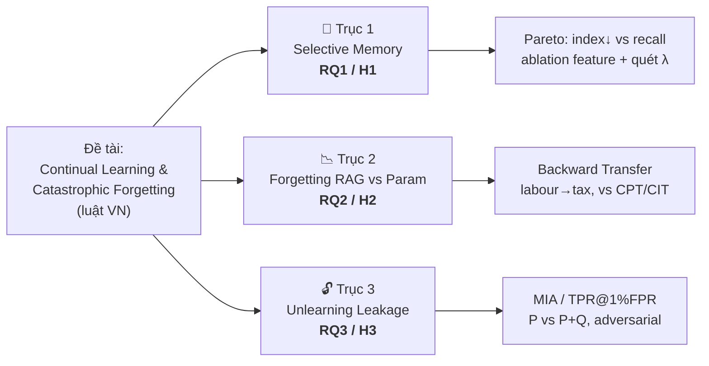

# Hướng tiếp cận — Lấy NGHIÊN CỨU làm trọng tâm (không phải engineering)

> ⚠️ **CẬP NHẬT HƯỚNG (2026-06-24):** Trục trung tâm giờ là **CATASTROPHIC FORGETTING qua nạp-tri-thức-liên-tục** (khuôn Bảng B của ReGrad), đo trên **QA / NLI / Syllogism**. **Selective memory** = chống *quên-kiểu-RAG* (kho phình → recall tụt). **Unlearning** hạ xuống *temporal-gating phụ*. Nguồn chuẩn: [redirect_rag_3tasks.md](../redirect_rag_3tasks.md). Phần "research vs engineering" bên dưới vẫn đúng, đọc theo cấu trúc mới.

> **Mục đích bộ note này:** chốt lại *đâu là phần nghiên cứu thật* (có giả thuyết, đo được, **có thể bị bác bỏ**) và *đâu chỉ là code* (deterministic, không có gì để thí nghiệm). Đây là phản ứng trực tiếp với các câu hỏi xoáy:
> - "RAG đã có nhiều rồi, em khác gì?"
> - "Xoá entry khỏi index thì RAG nào chả làm được — đâu phải hướng mới?"
> - "Gating theo quyền (ACL) nằm bên code chứ đâu phải hướng thực nghiệm?"
> - "Vậy *phần nào* của em là nghiên cứu, phần nào là kỹ thuật?"

---

## 0. Câu chốt (one-liner)

> Phần **code** (ACL, index-delete, audit log, versioning) **KHÔNG phải đóng góp**. Phần **nghiên cứu** là **ba câu hỏi đo được và có thể sai bằng số liệu**:
> 1. Hàm *importance* có **nén được index mà vẫn giữ recall + compliance** không? (Selective Memory)
> 2. RAG+LoRA (base frozen) có **quên ít hơn** parametric fine-tune khi học tuần tự không? (Forgetting)
> 3. Unlearning ở mức retrieval **thật tới đâu** khi *đo rò rỉ từ trọng số*? (Leakage)

---

## 1. Lằn ranh: ENGINEERING vs RESEARCH

Tiêu chí phân loại — một thành phần là **nghiên cứu** chỉ khi nó:
- có một **giả thuyết** phát biểu được,
- gắn một **hiện tượng đo được** (metric),
- và **có thể cho kết quả ngược với kỳ vọng** (falsifiable).

Nếu kết quả *biết trước 100%* và chỉ là "viết đúng code thì chạy đúng" → đó là **engineering**, không tính là đóng góp khoa học.

### Bảng phân loại đầy đủ

| Thành phần | Bản chất | Đóng góp nghiên cứu? | Lý do |
|---|---|:--:|---|
| Access-control gating (ACL) | `if role ∈ acl` | ❌ | Deterministic, không có gì để đo |
| Index deletion (RTBF hard-delete) | `index.delete(id)` | ❌ | Thao tác CSDL tầm thường |
| Audit log / versioning / rollback | Engineering | ❌ | Không có giả thuyết |
| Crawl + metadata tagging | Engineering (+ chất lượng) | 🟡 | Phụ trợ; chất lượng metadata là *assumption*, không phải đóng góp |
| **Importance score + Ebbinghaus decay** | Tradeoff đo được | ✅ | H1 — có Pareto, có thể sai |
| **Compliance hard-gate** | Ràng buộc bất biến | 🟡→✅ | Bản thân là rule, nhưng *chứng minh nó không hi sinh recall* là thí nghiệm |
| **RAG+LoRA vs CPT/CIT forgetting** | Giả thuyết trung tâm | ✅ | H2 — Backward Transfer, gắn tên đề tài |
| **Đo rò rỉ parametric sau unlearning** | Hiện tượng đo được | ✅ | H3 — MIA / TPR@1%FPR |

> **Quy tắc trình bày:** ACL / delete / audit chỉ được nhắc **một câu** "đã hiện thực hoá ở mức engineering". KHÔNG đưa lên slide đóng góp, KHÔNG dành mục thực nghiệm.

---

## 2. Ba trục thực nghiệm — bản đồ

| Trục | Vai trò trong luận văn | File chi tiết |
|---|---|---|
| **1. Selective Memory** | **Trục thực nghiệm CHÍNH** (nhiều thí nghiệm nhất, mới nhất, ít "code" nhất) | [`01_axis_selective_memory.md`](01_axis_selective_memory.md) |
| **2. Forgetting** | **Trục KHUNG** — buộc thẳng vào tên đề tài | [`02_axis_forgetting.md`](02_axis_forgetting.md) |
| **3. Unlearning Leakage** | **Trục RIGOR** — chứng tỏ trung thực khoa học | [`03_axis_unlearning_leakage.md`](03_axis_unlearning_leakage.md) |
| (Định vị + 2026 + phản biện) | Trả lời "RAG đã có rồi" | [`04_novelty_2026_and_rebuttals.md`](04_novelty_2026_and_rebuttals.md) |

---

## 3. Vì sao đây là cách phòng thủ đúng

- **Không over-claim:** thừa nhận thẳng cái gì là code → ghi điểm liêm chính, reviewer không bóp được.
- **Mỗi đóng góp là một giả thuyết bác bỏ được:** đây là dấu hiệu của *nghiên cứu thật*, không phải *bản demo kỹ thuật*.
- **Trọng tâm dịch về nơi có chiều sâu thực nghiệm:** ablation, parameter sweep, Pareto frontier, kiểm định thống kê, error analysis — đó là thứ biến "một hệ thống chạy được" thành "một luận văn".

> Đọc tiếp 3 file trục để thấy *từng thí nghiệm cụ thể, metric, và kịch bản kết quả NULL*.
