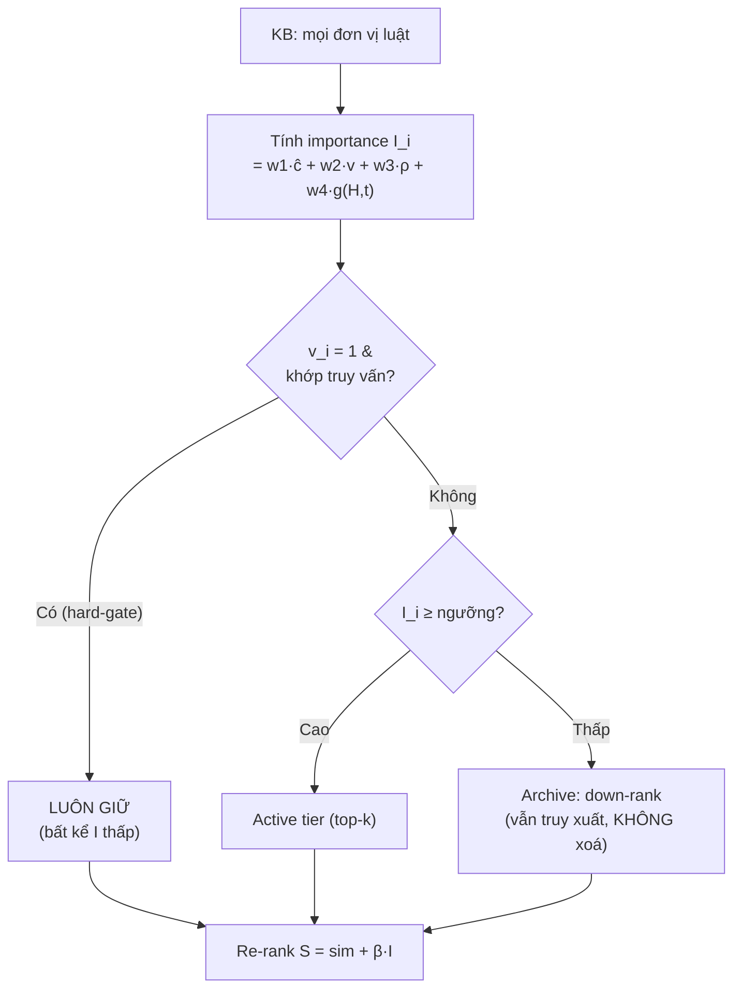

# Trục 1 — Selective Legal Memory (TRỤC THỰC NGHIỆM CHÍNH)

> Đây là phần **mới nhất** và **ít engineering nhất**. Câu hỏi cốt lõi: *có một cách "quên có chọn lọc" để **nén kho tri thức** mà **không làm tụt độ chính xác** và **không bỏ sót luật còn hiệu lực** không?*

---

## 1. RQ / Hypothesis

- **RQ1:** Một hàm *legal importance* kết hợp (citation centrality + hiệu lực + thứ bậc/rủi ro + tần suất truy cập theo Ebbinghaus) có cho phép **giảm đáng kể kích thước active-index** mà **giữ recall/accuracy** và **không vi phạm compliance** không?
- **H1:** Re-rank theo importance + decay **giảm ≥30% active-index** với **Recall@10 trong ±2%** so full-index, và compliance-coverage **= 100%** (không rơi luật hiệu lực).
- **Null (H1 bị bác):** importance là tín hiệu nhiễu → nén index thì recall tụt > 2%, hoặc decay đánh rơi luật hiếm-mà-quan-trọng → compliance < 100%.

> Điểm mấu chốt khiến đây là **nghiên cứu**: kết quả **không biết trước**. Hoàn toàn có thể importance không mang thông tin và H1 sai.

---

## 2. Cơ chế (nhắc lại để gắn thí nghiệm)

**Importance score** của đơn vị tri thức $u_i$:

$$ I_i = w_1\,\hat{c}_i + w_2\,v_i + w_3\,\rho_i + w_4\,g(H_i,t) $$

- $\hat{c}_i$ — citation centrality (vị trí trong mạng trích dẫn pháp lý)
- $v_i$ — validity flag (còn hiệu lực)
- $\rho_i$ — risk/hierarchy weight (Hiến pháp > Luật > Nghị định > Thông tư)
- $g(H_i,t)=\sum_{\tau<t} e^{-\lambda(t-\tau)}$ — **Ebbinghaus decay** trên lịch sử truy cập $H_i$

**Re-rank:** $S = \mathrm{sim}(q,e_i) + \beta\,I_i$

**Compliance hard-gate (BẤT BIẾN):** $v_i = 1$ & khớp truy vấn ⇒ **luôn giữ**, dù $I_i$ thấp. → "quên" = *giảm nhiễu xếp hạng*, KHÔNG = *mất coverage*.



---

## 3. Thiết kế thực nghiệm (đây mới là chiều sâu)

### 3.1 Ablation từng feature
Bật/tắt từng thành phần của $I_i$ để cô lập đóng góp:

| Cấu hình | $\hat c$ | $v$ | $\rho$ | decay | Đo |
|---|:--:|:--:|:--:|:--:|---|
| sim-only (baseline) | – | – | – | – | Recall@10, MRR@10 |
| + citation | ✓ | – | – | – | Δ vs baseline |
| + validity | ✓ | ✓ | – | – | Δ |
| + risk | ✓ | ✓ | ✓ | – | Δ |
| **full (+decay)** | ✓ | ✓ | ✓ | ✓ | Δ + index-size |

### 3.2 Quét tham số decay $\lambda$
Vẽ đường: $\lambda$ (trục x) vs {index-size, Recall@10, compliance-coverage}.
→ Tìm "knee point": nén tối đa **trước khi** recall/compliance bắt đầu gãy.

### 3.3 Đường Pareto (figure đắt nhất của luận văn)
```
Recall@10
  ^
1.0|  * full-index (baseline)
   |   \
   |    *·.            ← vùng "ăn không": nén nhiều, recall ~ giữ
   |       *··.
0.9|----------*----------------- ngưỡng chấp nhận (±2%)
   |            \
   |             *   ← decay quá mạnh: recall sụp
   +------------------------------> Active-index size (%)
     30%      60%      100%
```
- **H1 đúng** nếu tồn tại điểm ở **≤70% size** mà còn nằm trên ngưỡng 0.9.
- Báo cáo kèm **kiểm định thống kê** (bootstrap CI trên truy vấn held-out).

### 3.4 Stress test compliance (Scenario C)
Nén index mạnh dần, kiểm tra **có điều luật hiệu lực nào bị rơi khỏi câu trả lời không**. Mục tiêu: compliance-coverage = 100% ở **mọi** mức nén (nhờ hard-gate). Nếu < 100% → hard-gate hỏng → bug, không phải kết quả.

---

## 4. Metrics

| Nhóm | Metric |
|---|---|
| Retrieval | Recall@K, MRR@10 |
| Task | QA accuracy, NLI accuracy, syllogism score (LegalSLM) |
| Compliance | % câu trả lời dùng luật hiệu lực + KHÔNG viện dẫn luật bãi bỏ |
| Cost | active-index size, retrieval latency |

---

## 5. Vì sao mới (so với RAG generic)

| RAG flat-index | Selective Legal Memory |
|---|---|
| Mọi chunk ngang nhau, xếp theo $\mathrm{sim}$ | Xếp theo $\mathrm{sim} + \beta I$, có **decay nhận thức** |
| Không khái niệm "hiệu lực" | **Validity hard-gate** bất biến |
| Không có thứ bậc pháp lý | $\rho$ theo Hiến pháp > Luật > NĐ > TT |
| Index phình theo thời gian | **Nén có nguyên tắc**, archive thay vì xoá |

→ Đây là **memory management đặc thù luật**, không phải "RAG tốt hơn". Cảm hứng decay: `Sumida_2025`.

---

## 6. Threats to validity (đã ghi ở 3.1, nhắc để nhất quán)
- **Construct validity:** importance là proxy, không có gold-standard → tune trên dev set, ablate từng feature, đánh giá trên truy vấn unseen (tránh vòng tròn tự tối ưu - tự đánh giá).
- **Decay đánh rơi luật hiếm-quan-trọng:** chính là lý do có **hard-gate**; chứng minh bằng Scenario C.

---

## 7. Kịch bản NULL (trưởng thành nghiên cứu)
> H1 null → importance chưa đủ tín hiệu. **Vẫn là đóng góp**: chỉ ra rằng với luật VN, nén index theo importance **không** an toàn → hướng feature mới (vd. embedding-cluster, query-log mining). Báo cáo trung thực, không giấu.
