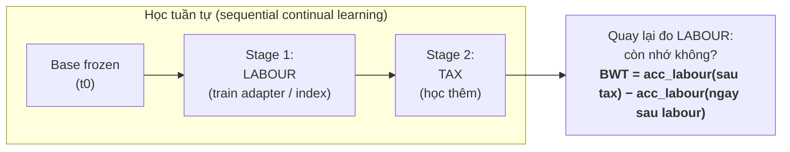

# Trục 2 — Catastrophic Forgetting: RAG+LoRA vs Parametric (TRỤC KHUNG)

> ⚠️ **NÂNG THÀNH TRỤC TRUNG TÂM (2026-06-24):** mở rộng theo **kịch bản nạp-tri-thức-liên-tục** (khuôn Bảng B của ReGrad): CPT **quên thảm khốc**, RAG **né quên**, ReGrad **đối chiếu bán-tham số**, selective RAG chống tụt-recall — tất cả đo trên **QA/NLI/Syllogism**. Chi tiết: [redirect_rag_3tasks.md](../redirect_rag_3tasks.md).

> Trục này **buộc thẳng vào tên đề tài** ("Continual Learning & Catastrophic Forgetting"). Nó trả lời câu hỏi trung tâm: *cách tiếp cận frozen-base + RAG có **thật sự** quên ít hơn fine-tune trọng số không — đo bằng số, không nói suông?*

---

## 1. RQ / Hypothesis

- **RQ2:** Khi học **tuần tự** qua các phân ngành luật (lao động → thuế), kiến trúc **frozen-base + RAG (+ LoRA hành vi)** có giữ được năng lực trên ngành cũ **tốt hơn** Continual Pre-Training / Instruction Tuning (CPT/CIT) không?
- **H2:** RAG+LoRA có **Backward Transfer (BWT) ≈ 0** (gần như không quên facts ngành cũ), trong khi CPT/CIT có **BWT âm rõ rệt** (quên).
- **Null / kết quả ngược:** RAG+LoRA có thể **kém legal-accuracy tuyệt đối** hơn CPT (vì reasoning bị chặn bởi base frozen) → lộ đánh đổi *"learns less, forgets less"* — **vẫn là phát hiện có giá trị**.

---

## 2. Vì sao cần ≥2 ngành (lao động → thuế)

Forgetting **chỉ quan sát được khi có ≥2 task tuần tự**. Học 1 ngành thì không có "ngành cũ" để mà quên.



- **Lao động** = sub-domain cho task 1 (đủ 3 scenario A/B/C).
- **Thuế** = sub-domain cho task 2 trong chuỗi (đủ data để *kích hoạt* forgetting).
- Đây là **nguồn data dựng kịch bản**, KHÔNG phải scope thu hẹp — framework domain-general.
- Sau khi học thuế → **đo lại lao động** → BWT.

---

## 3. Định nghĩa metric

- **Backward Transfer (BWT):**
  $$ \mathrm{BWT} = \frac{1}{T-1}\sum_{i=1}^{T-1}\big(a_{T,i} - a_{i,i}\big) $$
  với $a_{k,i}$ = độ chính xác trên task $i$ sau khi học xong task $k$.
  - BWT < 0 ⇒ **quên** (học task sau làm hỏng task trước).
  - BWT ≈ 0 ⇒ **không quên** (kỳ vọng của RAG frozen).
- **Forgetting Gradient** (theo `kalajdzievski2024scalinglawsforgettingfinetuning`): độ dốc suy giảm khi tăng cường độ cập nhật parametric.
- (Phụ) **Forward Transfer** — học ngành trước có giúp ngành sau không.

---

## 4. Thiết kế thực nghiệm

### 4.1 Các nhánh so sánh (arms)
| Arm | Mô tả | Kỳ vọng forgetting |
|---|---|---|
| **A. RAG+LoRA (đề tài)** | base frozen, facts ở KB, behavior ở LoRA | BWT ≈ 0 |
| **B. CPT scaled-down** | tiếp tục pre-train trọng số trên ngành | BWT âm mạnh |
| **C. CIT scaled-down** | instruction-tuning tuần tự trên trọng số | BWT âm |
| **D. ReGrad (đối chiếu)** | semi-parametric, gradient bank | BWT nhỏ nhưng latency cao |

> Baseline parametric chạy **scaled-down** (mô hình nhỏ / tập con) — đủ để đo **xu hướng** forgetting, không cần full-scale (đã ghi rủi ro compute ở Ch4). ReGrad (`su2026retrievablegradientscontinualposttraining`) chỉ làm **điểm đối chiếu**, không phải baseline chính.

### 4.2 Biến đo
- Đường **BWT theo số task** (1 ngành → 2 ngành → … nếu mở rộng).
- **Retain ngành cũ vs Acquire ngành mới**: vẽ cả hai để thấy đánh đổi.
- **General-ability retention**: giữ một tập zero-shot tiếng Việt tổng quát, đo trước/sau (chứng minh base không bị hư).

### 4.3 Sơ đồ kết quả kỳ vọng
```
Acc trên LABOUR (task cũ)
  ^
  |  ●─────────●  RAG+LoRA  (giữ ~phẳng → BWT≈0)
  |
  |  ●
  |    \
  |     \●        CPT/CIT   (tụt → BWT<0)  ← catastrophic forgetting
  +---------------------------> sau khi học TAX
   ngay sau LABOUR      
```

---

## 5. Vì sao đây là nghiên cứu, không phải hiển nhiên

- Trực giác "frozen thì không quên" **nghe hiển nhiên nhưng chưa được đo trên luật VN** với RAG selective. Có thể:
  - LoRA tuần tự (lao động→thuế) **vẫn gây collision** → quên một phần (đó là lý do có O-LoRA/N-LoRA/SLIM ở 3.4) → cần đo xem có cần không.
  - RAG có thể **kéo nhầm context ngành thuế** vào câu hỏi lao động → "interference" ở tầng retrieval, không phải tầng weight → một loại forgetting *mới* đáng phân tích.
- → Có **nhiều khả năng kết quả không như trực giác** ⇒ đáng nghiên cứu.

---

## 6. Liên kết tài liệu
- Inverse scaling của forgetting: `kalajdzievski2024scalinglawsforgettingfinetuning`, `li2024revisitingcatastrophicforgettinglarge`.
- Stability gap khi CPT: `gupta2023continualpretraininglargelanguage`, `guo2024efficientcontinualpretrainingmitigating`.
- LoRA "learns less, forgets less": `biderman2024loralearnsforgets`.
- Sequential multi-task collision + remedy: `wang-etal-2023-orthogonal`, `yang2024parametercollisionhinderingcontinual`, `han-etal-2025-slim`.
- Semi-parametric đối chiếu: `su2026retrievablegradientscontinualposttraining`.
- Time-continual eval: `li2025ticlm`.
