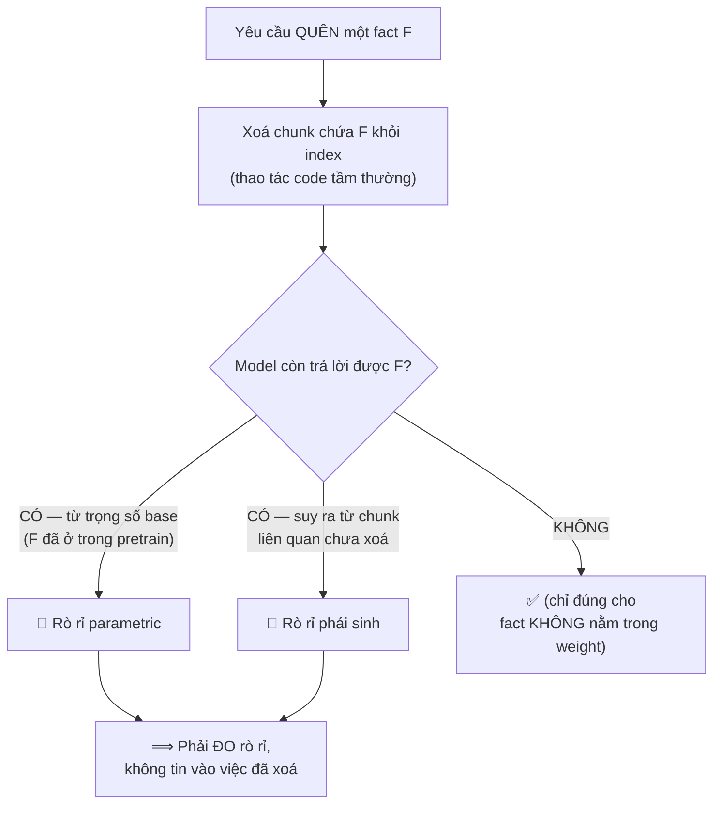

# Trục 3 — Unlearning Leakage: "quên" có THẬT không? (TRỤC RIGOR)

> Đây là trục trả lời thẳng phản biện: *"Xoá entry khỏi index thì RAG nào chả làm — đâu phải hướng mới?"* và *"ACL gating nằm bên code, đâu phải thực nghiệm?"*
>
> **Thừa nhận trước:** xoá index = code tầm thường; ACL = `if` check = code tầm thường. **Cả hai KHÔNG phải đóng góp.** Phần nghiên cứu nằm ở chỗ *deletion ≠ model thật sự quên*.

---

## 1. Vì sao "xoá index" KHÔNG giải quyết bài toán



**Kết luận:** một `index.delete(id)` **không nói được gì** về việc model có còn lộ F hay không. Bài toán nghiên cứu là **đo và giảm rò rỉ còn lại** — không phải thao tác xoá.

---

## 2. Ba loại "quên" — cái nào là code, cái nào là research

| Loại forget | Cách xử lý đúng | Là code hay research? |
|---|---|---|
| **Temporal** (luật hết hiệu lực) | **KHÔNG xoá** — giữ, gắn $v{=}0$, chỉ chặn trình bày như luật *hiện hành*; vẫn trả lời "luật **năm 2015**…" | 🔬 Research: đúng/sai theo **temporal regime**, đo được |
| **Access-control** (án mật) | Lọc theo `acl` từng truy vấn/danh tính | 🔧 **Code thuần** — `if` check, KHÔNG đem ra làm đóng góp |
| **Personal data (RTBF)** | Hard-delete entry | 🔧 Xoá là code; 🔬 **research = chứng minh model không còn lộ** (rò rỉ trọng số) |

> Nhìn bảng: **2/3 trường hợp, xoá là SAI** (temporal phải giữ, ACL chỉ lọc). Phần research thật = (a) temporal-keep-but-gate đúng theo thời gian, (b) **đo rò rỉ** ở trường hợp xoá.

---

## 3. RQ / Hypothesis

- **RQ3:** Sau khi gỡ fact khỏi tầng retrieval (Policy $P$), model còn **rò rỉ** fact đó từ trọng số bao nhiêu? Ràng buộc đầu ra $Q$ **giảm rò rỉ** được bao nhiêu, và **bền** tới đâu dưới tấn công paraphrase/jailbreak?
- **H3:** $P{+}Q$ đạt **USR cao** + **ROUGE-L ≤ 0.15** trên forget set + **TPR ≤ 1% @1%FPR**, trong khi **harmlessness ≥ 95%** trên retain set (không hại truy vấn lành).
- **Null:** nếu $Q$ không giảm rò rỉ dưới jailbreak → **định lượng được giới hạn của retrieval-level unlearning** = đóng góp cảnh báo (vẫn có giá trị khoa học).

---

## 4. Cơ chế P + Q (nhắc lại)

- **P (retrieval-level):** $KB_T = \{\,u \notin T \;\wedge\; \mathrm{Authorize}(u,q,t_q)\,\}$ — entry cần quên **không vào** candidate. (Reversible — khác hard-delete.)
- **Q (output-level):** ràng buộc prompt **không viện dẫn / không tiết lộ** $T$ — chặn rò rỉ từ trọng số base.

> $P$ xử lý "không truy xuất", $Q$ xử lý "dù model *biết* từ weight cũng không nói". Rò rỉ còn lại sau $P{+}Q$ chính là đại lượng cần **đo**.

---

## 5. Thiết kế thực nghiệm (đây là chiều sâu, không phải code)

### 5.1 Forget set ↔ Retain set (matched)
- **Forget set** $T$: các fact phải quên.
- **Retain set**: cùng chủ đề, cùng kích thước, KHÔNG bị quên → đo **harmlessness** (không được vạ lây).

### 5.2 Ablation P vs P+Q
| Cấu hình | Đo | Mục đích |
|---|---|---|
| No-unlearn (baseline) | leakage cao | mốc trên |
| **P only** | USR, ROUGE-L, **TPR@1%FPR** | retrieval đủ chưa? |
| **P + Q** | như trên | Q giảm rò rỉ thêm bao nhiêu |
| P+Q + filter | như trên | filter đầu ra đóng góp gì |

### 5.3 Đo rò rỉ bằng membership-inference
- **TPR@1%FPR**: tỉ lệ phát hiện đúng fact đã quên ở ngưỡng FPR 1% — *càng thấp càng tốt*.
- **ROUGE-L trên forget set**: model còn tái tạo nội dung đã quên tới đâu.
- **Unlearning Success Rate (USR)**.

### 5.4 Đường robustness dưới tấn công (figure rigor)
```
Leakage (TPR@1%FPR)
  ^
  |          ●  P only        (paraphrase nhẹ đã lộ)
  |         /
  |        /
  |   ●───●  P+Q              (bền hơn, lộ ít)
  |  /
  +--------------------------------> cường độ tấn công
     direct → paraphrase → jailbreak
```
→ So sánh độ dốc rò rỉ của $P$ vs $P{+}Q$ khi tăng cường độ jailbreak. **Đây là thí nghiệm**, không phải code.

---

## 6. Ranh giới phải nói thẳng (chống over-claim)

- Đây là **behavioral / retrieval-level unlearning**, **KHÔNG** claim xoá khỏi trọng số.
- Model-level unlearning (gỡ khỏi weight) **ngoài phạm vi** — đắt, khó verify (`11207222`).
- Phần rò rỉ parametric còn lại được **báo cáo như cận trên**, không che giấu.

> Câu nói: *"Em không tin vào việc đã xoá — em **đo** xem model còn lộ không. Đóng góp là *đo được giới hạn*, không phải *phát minh ra việc xoá*."*

---

## 7. Liên kết tài liệu
- RAG-based unlearning, USR/utility: `11207222`.
- Temporal/supersession là một dạng unlearning theo thời gian: `li2025ticlm`.
- (Privacy/log minimization cho audit: ghi ở 3.3, là engineering note.)
