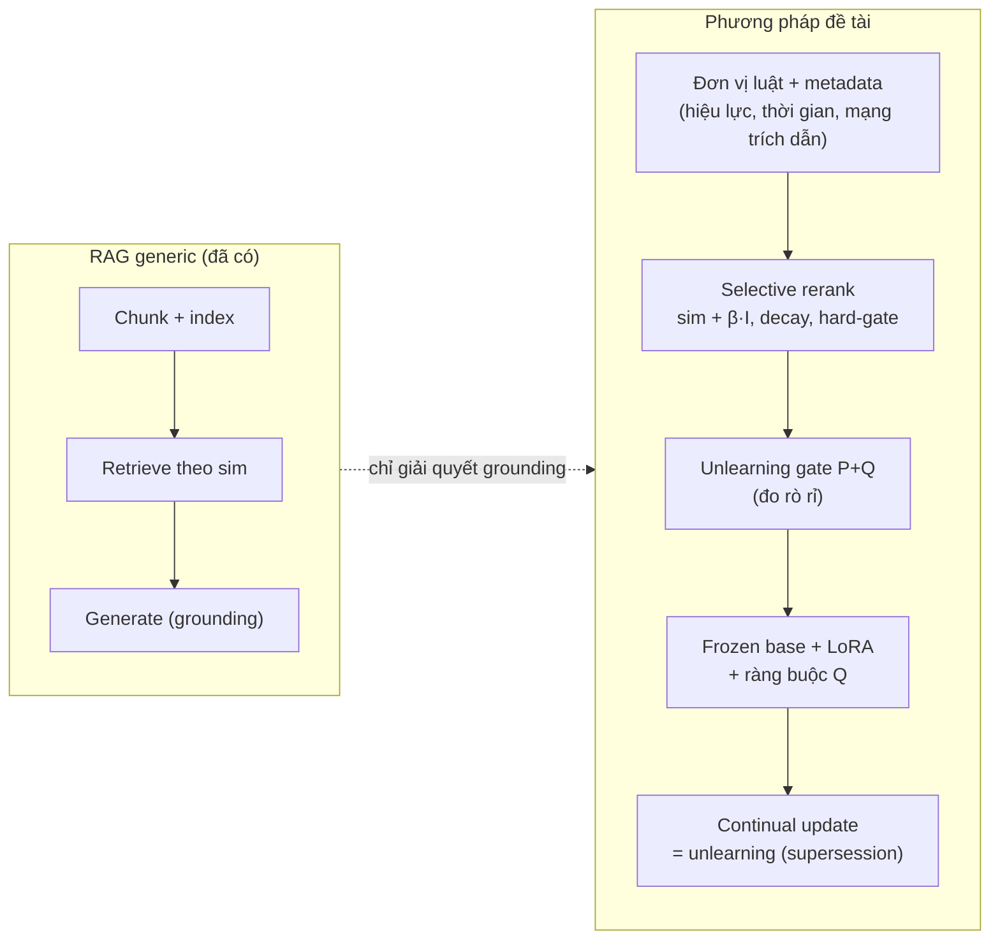

# Định vị Novelty + Hướng 2026 + Kịch bản phản biện

> ⚠️ **CẬP NHẬT (2026-06-24):** Novelty giờ định vị quanh **RAG chống catastrophic forgetting khi nạp tri thức liên tục, đo trên 3 task (QA/NLI/Syllogism)**; **ReGrad** = đối chiếu bán-tham số chính (Bảng B). Selective memory = chống quên-kiểu-RAG. Xem [redirect_rag_3tasks.md](../redirect_rag_3tasks.md).

> File "cầm tay khi bảo vệ" cho nhóm câu hỏi *"RAG đã có nhiều rồi, em khác gì?"*. Nguyên tắc xuyên suốt: **đổi khung — không phòng thủ "RAG của em tốt hơn", mà tái định vị RAG thành nền tảng cho continual learning + unlearning."**

---

## 1. RAG generic vs phương pháp đề tài

| Tiêu chí | **RAG generic** | **Đề tài** |
|---|---|---|
| Mục tiêu | Grounding câu trả lời | **Substrate cho CL + unlearning + compliance** |
| Kho tri thức | Flat, tĩnh | Metadata **hiệu lực + thời gian + trích dẫn**; decay; **hard-gate** |
| Quên / gỡ | Không (chỉ thêm) | **P+Q có đo rò rỉ**, taxonomy 3 regime |
| Thời gian | Không phân biệt | **Temporal regime** (đúng theo mốc) |
| Facts vs hành vi | Lẫn lộn | **Tách**: RAG=facts, LoRA=behavior (cơ sở SVD rank) |
| Cập nhật | Re-index thô | Update = unlearning **chung một bộ máy** |

> **Khẳng định trung thực:** KHÔNG claim thuật toán RAG mới. Novelty = **tích hợp + thích ứng miền luật + tái định vị + đo được**.

---

## 2. "2026 đang hướng đến gì" (chứng minh hợp thời)

| Trào lưu 2026 | Ý | Dẫn chứng (bib) |
|---|---|---|
| Rời fine-tune trọng số → **semi-parametric / retrievable** | Cộng đồng chuyển sang để facts ra ngoài | `su2026retrievablegradientscontinualposttraining` (ReGrad) |
| **Machine unlearning / RTBF** ở mức retrieval | Thay gradient-ascent đắt; áp lực quy định | `11207222` |
| **Temporal / time-continual LLM** | Tri thức có "tuổi", trả lời theo mốc | `li2025ticlm` |
| **Memory-centric CL cho low-resource** | Dataset luật VN vừa ra 2025–2026 | `nguyen2025vlqa…`, `duong2026vilegalnli…`, `le-etal-2025-overview` |

> Lập luận: *"Chính ReGrad 2026 là bằng chứng cộng đồng đang đi hướng semi-parametric. Em đi xa hơn về phía **non-parametric thuần** để được **unlearn dễ + latency thấp + auditable** — đúng cái parametric đang bế tắc."*

---

## 3. Kịch bản phản biện (Q → cách trả lời)

### Q1. "RAG/unlearning/selective memory đã có — mới gì?"
→ Không claim thuật toán mới. Mới = (1) **selective memory có compliance hard-gate + decay** đặc thù luật; (2) **temporal regime**; (3) hợp nhất **update+unlearning**; (4) benchmark **legal-CL VN**. Đo được cả 4.

### Q2. "Xoá entry khỏi index thì RAG nào chả làm — đâu phải mới?" ⭐
→ **Đồng ý — xoá index là tầm thường, KHÔNG phải đóng góp của em.** Với temporal & access-control thì **không được xoá** (phải gating); với xoá thật thì vấn đề khó là **model vẫn lộ từ trọng số** → em **đo rò rỉ** (TPR@1%FPR), không tin việc đã xoá. Xem [`03_axis_unlearning_leakage.md`](03_axis_unlearning_leakage.md).

### Q3. "ACL gating nằm bên code, đâu phải hướng thực nghiệm?" ⭐
→ **Đúng — ACL là `if` check, em KHÔNG nhận là đóng góp.** Phần thực nghiệm nằm ở 3 trục đo được: selective-memory tradeoff, forgetting RAG-vs-parametric, leakage. Xem [`00_README`](00_README_research_approach.md).

### Q4. "Phần nào của em là nghiên cứu, phần nào là code?" ⭐
→ Code: ACL, delete, audit, versioning. **Nghiên cứu (có thể bị bác bằng số liệu):**
  1. importance có nén index mà giữ recall không (H1),
  2. RAG có quên ít hơn parametric không (H2, Backward Transfer),
  3. unlearning thật tới đâu khi đo rò rỉ (H3).

### Q5. "Frozen base thì reasoning đủ cho luật không?"
→ Giới hạn đã biết (syllogism LegalSLM ~0.5); LoRA + selective context giảm lỗi; **nêu rõ ở Limitations**, không over-claim. Đây là đánh đổi *có chủ đích*: learns less, forgets less.

---

## 4. Một câu chốt (nếu chỉ được nói 1 câu)

> *"Điểm khác biệt không nằm ở 'retrieve giỏi hơn', mà ở chỗ em biến RAG thành **một bộ nhớ pháp lý biết quên đúng luật, đúng lúc, và giải trình được** — và em **đo** ba thứ có thể sai: nén index, forgetting, và rò rỉ. Code (xoá, ACL) em không nhận là đóng góp."*

---

## 5. Liên kết bộ note
- Tổng quan + lằn ranh engineering/research → [`00_README_research_approach.md`](00_README_research_approach.md)
- Trục 1 (chính) → [`01_axis_selective_memory.md`](01_axis_selective_memory.md)
- Trục 2 (khung) → [`02_axis_forgetting.md`](02_axis_forgetting.md)
- Trục 3 (rigor) → [`03_axis_unlearning_leakage.md`](03_axis_unlearning_leakage.md)
