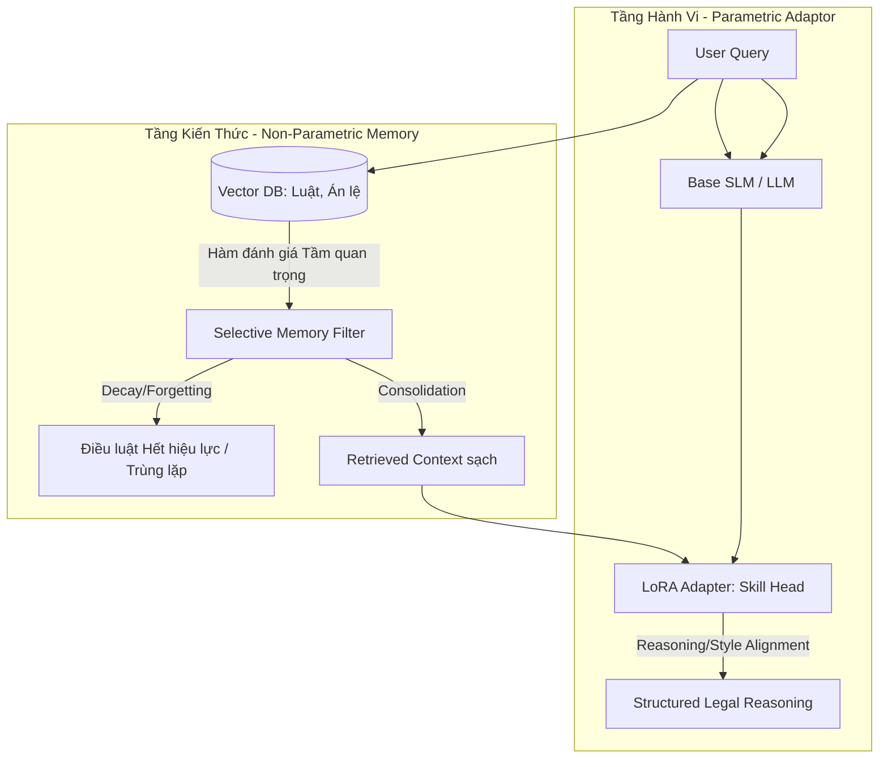
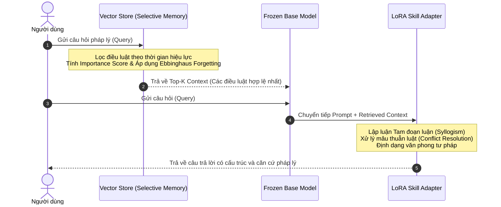

# Workflow: Selective Legal RAG + Behavior LoRA for Continual Legal AI

Tài liệu này trình bày tư duy thiết kế, phân vai trò hệ thống, và sơ đồ workflow kết hợp giữa **Selective RAG Memory** (Tầng kiến thức) và **LoRA/PEFT** (Tầng hành vi) để giải quyết bài toán Học liên tục (Continual Learning) trong miền pháp luật Việt Nam mà không gây quên thảm khốc (catastrophic forgetting).

---

## 1. Phân vai trò hệ thống (Knowledge vs. Behavior)

Hệ thống được thiết kế theo mô hình **bán tham số (semi-parametric)** chia làm hai tầng độc lập:

### A. RAG / External Memory (Tầng Kiến Thức - Knowledge)
* **Mục tiêu**: Lưu trữ và cập nhật thông tin pháp luật thô (VBQPPL, Thông tư, Nghị định, Án lệ) biến động theo thời gian.
* **Cơ chế**: Sử dụng bộ nhớ RAG động (Selective/Dynamic Memory) kế thừa triết lý từ các nghiên cứu **LUFY** và **ARM** (Ebbinghaus forgetting curve):
  * **Legal Importance Score**: Đánh giá tầm quan trọng của điều luật dựa trên **Citation Graph Centrality** (được trích dẫn nhiều trong các văn bản khác), **Hiệu lực thi hành** (tránh hồi tố luật cũ), và **Mức độ rủi ro/Mức phạt**.
  * **Selective Retention & Forgetting**: Tự động quên (loại bỏ khỏi index hoặc lưu vào bộ nhớ lưu trữ sâu) các văn bản đã bị bãi bỏ hoặc sửa đổi, giữ cửa sổ ngữ cảnh luôn cô đọng và chính xác.
* **Ý nghĩa đối với Học liên tục (CL)**: Tránh hoàn toàn việc "huấn luyện lại trọng số" chỉ để nhớ một điều luật mới. Giải quyết triệt để lỗi quên kiến thức luật cũ khi nạp dữ liệu liên tục.

### B. LoRA / PEFT (Tầng Hành Vi - Skill/Behavior)
* **Mục tiêu**: Định hình khả năng lập luận (Reasoning), văn phong tư pháp (Legal Style), và tuân thủ các nguyên tắc ưu tiên luật.
* **Cơ chế**: Huấn luyện một/nhiều LoRA adapter nhỏ gắn lên mô hình gốc cố định (Frozen Base Model):
  * **Conflict Resolution**: Học cách xử lý khi context của RAG chứa các thông tin mâu thuẫn (ví dụ: Luật cũ chưa hết hiệu lực hoàn toàn vs. Luật mới ban hành). LoRA sẽ học kỹ năng ưu tiên luật mới hoặc luật chuyên ngành.
  * **Memory Fusion**: Học cách liên kết, đối chiếu giữa thông tin ngữ cảnh RAG truy xuất được và tri thức chung sẵn có trong trọng số mô hình.
* **Ý nghĩa đối với Học liên tục (CL)**:
  * Trọng số Base Model được khóa băng (frozen) $\rightarrow$ Không bị trôi dạt (no weight drift) năng lực ngôn ngữ tổng quát.
  * Kỹ năng xử lý được đóng gói trong LoRA $\rightarrow$ Có thể huấn luyện với kỹ thuật LoRA trực giao (Orthogonal LoRA) hoặc phân vùng bộ nhớ (Dual-Memory) để bảo toàn kỹ năng cũ khi học kỹ năng lập luận mới.

---

## 2. Workflow vận hành chi tiết

---

## 3. Cách trình bày với Thầy (The Storytelling Strategy)

Khi báo cáo đề cương nghiên cứu với giáo viên hướng dẫn, bạn nên dẫn dắt theo logic 3 bước sau:

1. **Vấn đề đặt ra (The Pain Point)**:
   > *"Thưa thầy, bài toán đặt ra là mô hình ngôn ngữ pháp lý cần được cập nhật tri thức pháp luật mới liên tục. Nếu ta liên tục tinh chỉnh (Continual Fine-Tuning) trọng số của mô hình, mô hình sẽ bị **Quên thảm khốc** các văn bản luật cũ và mất đi năng lực ngôn ngữ tự nhiên cơ bản (Weight Drift). Hơn nữa, việc huấn luyện lại mô hình mỗi khi có luật mới ban hành là cực kỳ tốn kém và chậm chạp."*

2. **Ý tưởng giải pháp (The Dual-Engine Approach)**:
   > *"Để khắc phục, em đề xuất giải pháp tách đôi hệ thống thành **Tầng Kiến Thức (phi tham số - RAG)** và **Tầng Hành Vi (tham số - LoRA)**:*
   > * * **RAG thông minh**: Không chỉ là tìm kiếm từ khóa thông thường, mà tích hợp cơ chế quên/nhớ chọn lọc (Selective Memory). Khi văn bản luật hết hiệu lực, hệ thống tự động loại bỏ (Forget) khỏi Vector Store, giúp mô hình không bị nhầm lẫn và tối ưu ngữ cảnh.
   > * * **LoRA lập luận**: Base model được giữ nguyên để bảo toàn năng lực chung. Em chỉ huấn luyện LoRA để dạy mô hình **kỹ năng đọc hiểu luật từ RAG**, cách đối chiếu luật cũ-mới, lập luận tam đoạn luận và sinh văn bản đúng chuẩn tư pháp."*

3. **Tính khả thi và Đóng góp khoa học (Feasibility & Contributions)**:
   > *"Hướng tiếp cận này gọn gàng hơn vì tận dụng được hạ tầng Vector DB có sẵn, tránh được việc huấn luyện phức tạp trực tuyến. Nó kế thừa trực tiếp các nghiên cứu nổi bật về Bộ nhớ RAG thích ứng (ARM, LUFY) và các nghiên cứu chứng minh LoRA hạn chế quên thảm khốc (O-LoRA, I-LoRA). Kết quả sẽ được đánh giá thực nghiệm trực tiếp trên các bộ dữ liệu chuẩn pháp luật Việt Nam như **VLQA**, **ViLegalNLI** và **VLegal-Bench**."*
